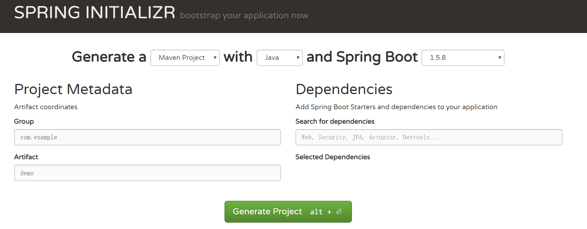

## 项目中使用springboot的jpa
首先要建一个springboot的项目，在http://start.spring.io/网站上边可以方便的建一个新的springboot工程。  
  
要想生成一个spring boot的工程，需要的主要依赖只需在图片的右边，输入名字就好，例如web jpa等  
在项目中进行配置（配置application.properties文件）  
 
    spring.datasource.url=jdbc:mysql://localhost:3306/test?useUnicode=true&characterEncoding=utf8  
    spring.datasource.username=root  
    spring.datasource.password=root  
    
    spring.datasource.driver-class-name=com.mysql.jdbc.Driver   
    spring.datasource.initial-size=3  
    spring.datasource.min-idle=5  
    spring.datasource.max-active=50  
    spring.datasource.maximum-pool-size=120  
    spring.datasource.max-wait=60000  
    
    #update 表示当实体类的属性发生变化时，表结构跟着更新  
    #create 表示启动的时候删除上一次生成的表，并根据实体类重新生成表，这个时候之前表中的数据就会被清空  
    #create-drop 这个表示启动时根据实体类生成表，但是当sessionFactory关闭的时候表会被删除  
    #validate 表示启动时验证实体类和数据表是否一致  
    #none 表示啥都不做  
    spring.jpa.hibernate.ddl-auto=update  
    
    #表示hibernate在操作的时候在控制台打印真实的sql语句  
    spring.jpa.show-sql=true  
    
    #表示格式化输出的json字符串  
    spring.jackson.serialization.indent_output=true  

# entity层

entity层需要有无参构造函数，否则会报错

getTop10ByTitleConditionAndIsDel(title, 0) //IsDel设置默认的0

@Query(value = "select * from `peiyou-pad`.`tb_experience_mgmt` "
      + "where `file_name` like CONCAT('%',:fileName,'%') and `is_del`=0 limit 10", nativeQuery = true)
List<ExperienceEntity> get10FuzzyRecordByFileName(@Param("fileName") String fileName);

在使用jpa的时候，DAO层使用 __fileName=:fileName__ 这种方式的时候，参数不加@Param("fileName")是错误的

表中使用create_time和update_time。update_time应该是与当前时间一致，create_time应该是我们主动写入的